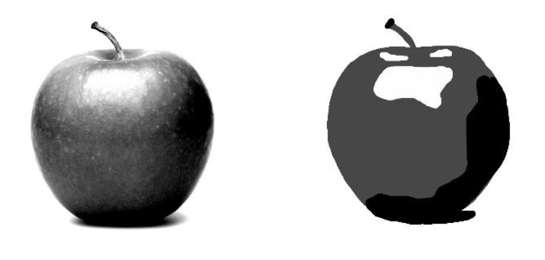
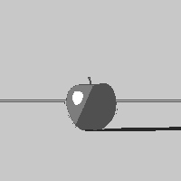

# 3D-to-2D-Image-Segmentation

The objective of this research project is to use neural network techniques, specifically a U-Net
model to create an image segmentation tool to extract shape, background, and 4 distinct shade
values from an inputted image of a 3-dimensional scene. This project works towards the problem of
automating rotoscoping within the field of animation, by transforming a 3D visual into a 2D
representation.

See the example below for the intended input and output of the model we wish to
create.

With frame by frame processing, an example output:

Notes about training: https://docs.google.com/document/d/1UR3cdtB8oMCLm-gZvn-QQyjIvpBqywMijAbCkbdImn0/edit?usp=sharing
