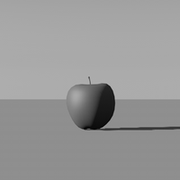
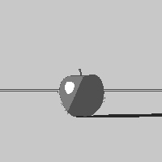

# 3D-to-2D-Image-Segmentation

The objective of this research project is to use neural network techniques, specifically a U-Net
model to create an image segmentation tool to extract shape, background, and 4 distinct shade
values from an inputted image of a 3-dimensional scene. This project works towards the problem of
automating rotoscoping within the field of animation, by transforming a 3D visual into a 2D
representation.

With frame by frame processing, an example output:

To train our model, we created a custom data set of segmented images using Cinema4D's multipass renderer.

To test it out yourself, organize the images you would like to test on into ./data/test_images.

The other folders in ./data train_images and train_results contain the data that is used in the train and validation sets.

## File Setup
- In ./UnprocessedImages you will find all the raw images we exported from Cinema4D's multipass renderer sorted by scene (ie. Shape)
- In ./ProcessedImages you will find all the edited images after having been ran through pixel_processing.py
- unet.py contains the U-Net model as well as the training loop and prediction
- segmentation_dataset.py contains a class to train and load images
- pixel_processing.py contains all the pre-processing functions. These can be run on the multipass layers outputted from Cinema4D.
- compression.py contains functions to assist with cropping and resizing
- util.py contains other utility functions such as file organization, and stitching frames back together into a gif

## Dependencies
- pytorch
- torchvision
- pillow
- numpy
- matplotlib

## To Run

After your desired file organization, run $ python3 unet.py 

When prompted, input "y" to retrain the model

To learn more about our research project and data processing, see the Reports folder.
